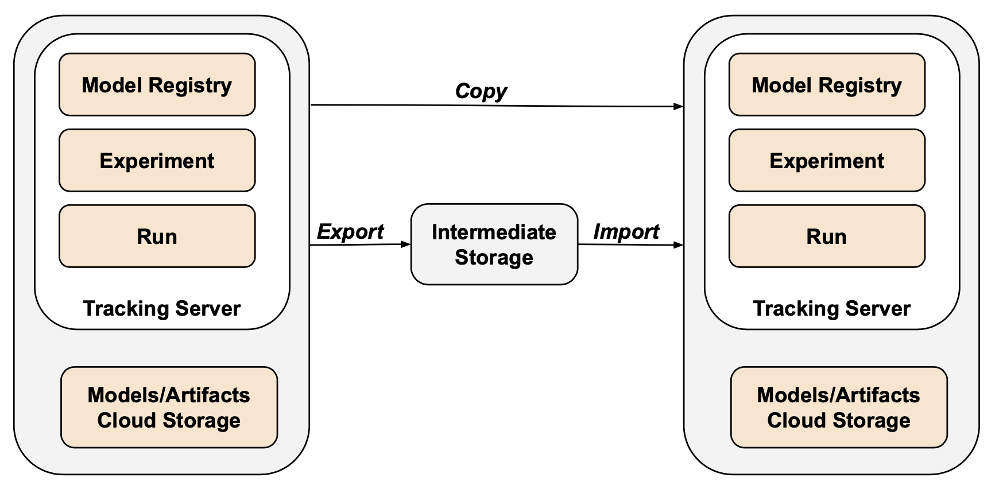

# Export and Import MLflow Experiments, Runs or Models

Tools to export and import MLflow objects (runs, experiments or registered models) from one tracking server (Databricks workspace) to another.
For details see the [Databricks_MLflow_Object_Relationships](https://github.com/amesar/mlflow-resources/blob/master/slides/Databricks_MLflow_Object_Relationships.pdf) slide deck.

Some of the reasons to use MLflow Export Import:
  * Share and collaborate with other data scientists in the same or another tracking server.
    * For example, you can a favorable experiment/run from another user to your own workspace.
  * Backup your experiments.
  * Migrate experiments to another tracking server.
  * Disaster recovery.

There are two ways to run MLflow Export Import:
* Open source MLflow - As a normal Python package - this page.
* [Databricks notebooks](databricks_notebooks/README.md).
## Architecture



## Overview

There are types of export/import tools:

* `Bulk tools` - high-level tools to copy a web of MLflow objects and maintain full object referential integrity with their original names.
* `Point tools` - lower-level tools to copy individual MLflow objects and have fine-grained control over the target names.

### Bulk tools

* Automated tool that migrates models and their versions' runs along with the runs' experiment.
* Original source model and experiment names are preserved.
* Leverages the "point" tools as basic building blocks.
* Bulk tools:
  * `export-all` - exports all the MLflow objects of the tracking server.
  * `export-models` - exports registered models and their versions' backing run along with the experiment that the run belongs to.
  * `import-models` - imports models and their runs and experiments from the above exported directory.

### Point tools

* Lower-level tools which allow you to control the target MLflow object's name.
* Useful for copying an MLflow object to another user - either in same or different tracking server.
* Are the basic building blocks for the bulk tools.

#### Experiments
  * Export experiments to a directory.
  * Import experiments from a directory.

#### Runs
  * Export a run to  a directory.
  * Import a run from a directory.

#### Registered Models
  * Export a registered model to a directory.
  * Import a registered model from a directory.
  * List all registered models.

## Limitations

### General Limitations

* Nested runs are only supported when you import an experiment. For a run, it is still a TODO.

### Databricks Limitations

* The Databricks API does not support importing notebook revisions.
* When you import a run, the link to its source notebook revision ID will appear in the UI but you cannot reach that revision (link is dead).
* For convenience, the export tool exports the desired notebook revision (latest revision or specific revision based on the --export-notebook-revision flag) for a notebook-based experiment but again, it cannot be attached to a run when imported. Its stored as an artifact in the "notebooks" folder of the run's artifact root.
* When importing a run or experiment, for open source MLflow you can specify the user owner. For Databricks import you cannot - the owner will be based on the personal access token (PAT) of the import user.

## Common options details 

`notebook-formats` - If exporting a Databricks experiment, the run's notebook (latest revision, not the revision associated with the run) can be saved in the specified formats (comma-delimited argument). Each format is saved in the notebooks folder of the run's artifact root directory as `notebook.{format}`. Supported formats are  SOURCE, HTML, JUPYTER and DBC. See Databricks [Export Format](https://docs.databricks.com/dev-tools/api/latest/workspace.html#notebookexportformat) documentation.

`use-src-user-id` -  Set the destination user ID to the source user ID. Source user ID is ignored when importing into Databricks since the user is automatically picked up from your Databricks access token.

`export-metadata-tags` - Creates metadata tags (starting with `mlflow_export_import.metadata`) that contain export information. These are the source `mlflow` tags in addition to other information. This is useful for provenance and auditing purposes in regulated industries.

```
Name                                  Value
mlflow_export_import.metadata.timestamp       1551037752
mlflow_export_import.metadata.timestamp_nice  2019-02-24 19:49:12
mlflow_export_import.metadata.experiment_id   2
mlflow_export_import.metadata.experiment-name sklearn_wine
mlflow_export_import.metadata.run-id          50fa90e751eb4b3f9ba9cef0efe8ea30
mlflow_export_import.metadata.tracking_uri    http://localhost:5000
```

## Setup

Supports python 3.7.6 or above.

### Console scripts

Python [console scripts](https://python-packaging.readthedocs.io/en/latest/command-line-scripts.html#the-console-scripts-entry-point)  (such as export-run, import-run) are provided as a convenience. For a list of scripts see [setup.py](setup.py).

This allows you to use
```
export-experiment --help
```
instead of
```
python -u -m mlflow_export_import.experiment.export_experiment --help
```

### Local setup

First create a virtual environment.
```
python -m venv mlflow-export-import
source mlflow-export-import/bin/activate
```

There are two different ways to install the package.

#### Install from github directly

```
pip install git+https:///github.com/amesar/mlflow-export-import/#egg=mlflow-export-import
```

#### Install from github clone
```
git clone https://github.com/amesar/mlflow-export-import
cd mlflow-export-import
pip install -e .
```

### Databricks setup

There are two different ways to install the package.

#### Install package in notebook

[Install notebook-scoped libraries with %pip](https://docs.databricks.com/libraries/notebooks-python-libraries.html#install-notebook-scoped-libraries-with-pip).


```
pip install git+https:///github.com/amesar/mlflow-export-import/#egg=mlflow-export-import
```

#### Install package as a wheel on cluster

Build the wheel artifact, upload it to DBFS and then [install it on your cluster](https://docs.databricks.com/libraries/cluster-libraries.html).

```
python setup.py bdist_wheel
databricks fs cp dist/mlflow_export_import-1.0.0-py3-none-any.whl {MY_DBFS_PATH}
```

## Bulk Tools

Top-level output directory structure.
```
+---experiments
+---models
```

For further directory structure see the `point` tool sections for experiments and models further below.

### Export the entire MLflow tracking server

Export all models, experiments and runs as well as a run's Databricks notebook (best effort).

Source: [export_all.py](mlflow_export_import/bulk/export_all.py).

#### Usage
```
Options:
  --output-dir TEXT               Output directory.  [required]
  --notebook-formats TEXT         Notebook formats. Values are SOURCE, HTML,
                                  JUPYTER or DBC (comma seperated).  [default: ]
  --export-notebook-revision BOOLEAN
                                  Export the run's notebook revision.
                                  Experimental not yet publicly available.
                                  [default: False]
```
#### Examples

```
export-all --output-dir
```

### Export models with their experiments and runs

Exports models and their versions' backing run along with the experiment that the run belongs to.

Source: [export_models.py](mlflow_export_import/bulk/export_models.py).

#### Usage
```
Options:
  --output-dir TEXT               Output directory.  [required]
  --models TEXT                   Models to export. Values are 'all', comma
                                  seperated list of models or model prefix
                                  with * ('sklearn*'). Default is 'all'
  --stages TEXT                   Stages to export (comma seperated). Default
                                  is all stages. Values are Production,
                                  Staging, Archived and None.
  --notebook-formats TEXT         Notebook formats. Values are SOURCE, HTML,
                                  JUPYTER or DBC (comma seperated).  [default: ]
  --export-notebook-revision BOOLEAN
                                  Export the run's notebook revision.
                                  Experimental not yet publicly available.
                                  [default: False]
  --help                          Show this message and exit.
```

#### Examples

##### Export all models

```
export-models --output-dir out
```

##### Export specified models
```
export-models \
  --output-dir out \
  --models sklearn-wine,sklearn-iris
```

##### Export models starting with prefix
```
export-models \
  --output-dir out \
  --models sklearn*
```

### Import models and experiments

Source: [import_models.py](mlflow_export_import/bulk/import_models.py).

#### Usage
```
Options:
  --input-dir TEXT                Input directory.  [required]
  --delete-model BOOLEAN          First delete the model if it exists and all
                                  its versions.  [default: False]
  --verbose BOOLEAN               Verbose.  [default: False]
  --use-src-user-id BOOLEAN       Set the destination user ID to the source
                                  user ID. Source user ID is ignored when
                                  importing into Databricks since setting it
                                  is not allowed.  [default: False]
  --import-mlflow-tags BOOLEAN    Import mlflow tags.  [default: False]
  --import-metadata-tags BOOLEAN  Import mlflow_export_import tags.  [default:
                                  False]
```

### Examples
```
import-models  --input-dir out
```


## Point tools

### Experiments 

#### Export Experiments

There are two scripts to export experiments:
* `export_experiment` - exports one experiment.
* `export_experiment_list` - exports a list of  experiments.

Both accept either an experiment ID or name.

##### export_experiment

Export one experiment to a directory.

###### Usage

```
export-experiment --help

Options:
  --experiment TEXT               Experiment name or ID.  [required]
  --output-dir TEXT               Output directory.  [required]
  --export-metadata-tags BOOLEAN  Export source run metadata tags.  [default: False]
  --notebook-formats TEXT         Notebook formats. Values are SOURCE, HTML,
                                  JUPYTER or DBC (comma seperated).  [default: ]
  --export-notebook-revision BOOLEAN
                                  Export the run's notebook revision.
                                  Experimental not yet publicly available.
                                  [default: False]
```

###### Export examples

Export experiment by experiment ID.
```
export-experiment \
  --experiment 2 \
  --output-dir out
```

Export experiment by experiment name.
```
export-experiment \
  --experiment sklearn-wine \
  --output-dir out
```

###### Databricks export examples

See [Access the MLflow tracking server from outside Databricks](https://docs.databricks.com/applications/mlflow/access-hosted-tracking-server.html).
```
export MLFLOW_TRACKING_URI=databricks
export DATABRICKS_HOST=https://mycompany.cloud.databricks.com
export DATABRICKS_TOKEN=MY_TOKEN

export-experiment \
  --experiment /Users/me@mycompany.com/SklearnWine \
  --output-dir out \
  --notebook-formats DBC,SOURCE 
```

###### Export directory structure

The output directory contains a manifest file and a subdirectory for each run (by run ID).
The run directory contains a run.json
([OSS](samples/oss_mlflow/experiments/1/6ccadf17812d43929b093d75cca1c33f/run.json),
[Databricks](samples/databricks/experiments/sklearn_wine/16c36560c57a43fdb46e98f88a8d8819/run.json)),
file containing run metadata and an artifact hierarchy.

```
+-manifest.json
+-441985c7a04b4736921daad29fd4589d/
| +-artifacts/
|   +-plot.png
|   +-sklearn-model/
|     +-model.pkl
|     +-conda.yaml
|     +-MLmodel
```

##### export_experiment_list

Export several (or all) experiments to a directory.

###### Usage
```
export-experiment-list --help

  --experiments TEXT              Experiment names or IDs (comma delimited).
                                  'all' will export all experiments.  [required]
  --output-dir TEXT               Output directory.  [required]
  --export-metadata-tags BOOLEAN  Export source run metadata tags.  [default: False]
  --notebook-formats TEXT         Notebook formats. Values are SOURCE, HTML,
                                  JUPYTER or DBC (comma seperated).  [default: ]
  --export-notebook-revision BOOLEAN
                                  Export the run's notebook revision.
                                  Experimental not yet publicly available.
                                  [default: False]
```

###### Export list examples

Export experiments by experiment ID.
```
export-experiment-list \
  --experiments 2,3 --output-dir out
```

Export experiments by experiment name.
```
export-experiment-list \
  --experiments sklearn,sparkml --output-dir out
```

Export all experiments.
```
export-experiment-list \
  --experiments all --output-dir out
```

```
Exporting experiment 'Default' (ID 0) to 'out/0'
Exporting experiment 'sklearn' (ID 1) to 'out/1'
Exporting experiment 'keras_mnist' (ID 2) to 'out/2'
. . .

249 experiments exported
1770/1770 runs succesfully exported
Duration: 1.6 seonds
```

###### Export directory structure

The output directory contains a manifest file and a subdirectory for each experiment (by experiment ID).

Each experiment subdirectory in turn contains its own manifest file and a subdirectory for each run.
The run directory contains a run.json file containing run metadata and artifact directories.

In the example below we have two experiments - 1 and 7. Experiment 1 (sklearn) has two runs (f4eaa7ddbb7c41148fe03c530d9b486f and 5f80bb7cd0fc40038e0e17abe22b304c) whereas experiment 7 (sparkml) has one run (ffb7f72a8dfb46edb4b11aed21de444b).

```
+-manifest.json
+-1/
| +-manifest.json
| +-f4eaa7ddbb7c41148fe03c530d9b486f/
| | +-run.json
| | +-artifacts/
| |   +-plot.png
| |   +-sklearn-model/
| |   | +-model.pkl
| |   | +-conda.yaml
| |   | +-MLmodel
| |   +-onnx-model/
| |     +-model.onnx
| |     +-conda.yaml
| |     +-MLmodel
| +-5f80bb7cd0fc40038e0e17abe22b304c/
| | +-run.json
|   +-artifacts/
|     +-plot.png
|     +-sklearn-model/
|     | +-model.pkl
|     | +-conda.yaml
|     | +-MLmodel
|     +-onnx-model/
|       +-model.onnx
|       +-conda.yaml
|       +-MLmodel
+-7/
| +-manifest.json
| +-ffb7f72a8dfb46edb4b11aed21de444b/
| | +-run.json
|   +-artifacts/
|     +-spark-model/
|     | +-sparkml/
|     |   +-stages/
|     |   +-metadata/
|     +-mleap-model/
|       +-mleap/
|         +-model/
```

Sample [experiment list manifest.json](samples/oss_mlflow/experiment_list/manifest.json).
```
{
  "info": {
    "mlflow_version": "1.11.0",
    "mlflow_tracking_uri": "http://localhost:5000",
    "export_time": "2020-09-10 20:23:45"
  },
  "experiments": [
    {
      "id": "1",
      "name": "sklearn"
    },
    {
      "id": "7",
      "name": "sparkml"
    }
  ]
}
```

Sample [experiment manifest.json](samples/oss_mlflow/experiment_list/1/manifest.json).

```
{
  "experiment": {
    "experiment_id": "1",
    "name": "sklearn",
    "artifact_location": "/opt/mlflow/server/mlruns/1",
    "lifecycle_stage": "active"
  },
  "export_info": {
    "export_time": "2022-01-14 03:26:42",
    "num_total_runs": 2,
    "num_ok_runs": 2,
    "ok_runs": [
      "4445f19b7bf04d0fb0173424db476198",
      "d835e17257ad4d6db92441ad93bec549"
    ],
    "num_failed_runs": 0,
    "failed_runs": []
  }
}
```


#### Import Experiments

Import experiments from a directory. Reads the manifest file to import expirements and their runs.

The experiment will be created if it does not exist in the destination tracking server. 
If the experiment already exists, the source runs will be added to it.

There are two scripts to import experiments:
* import_experiment - imports one experiment
* import_experiment_list - imports a list of experiments

##### import_experiment

Imports one experiment.

###### Usage
```
import-experiment --help \

Options:
  --input-dir TEXT                Input path - directory  [required]
  --experiment-name TEXT          Destination experiment name  [required]
  --just-peek BOOLEAN             Just display experiment metadata - do not import
  --use-src-user-id BOOLEAN       Set the destination user ID to the source
                                  user ID. Source user ID is ignored when
                                  importing into Databricks since setting it
                                  is not allowed.
  --import-mlflow-tags BOOLEAN    Import mlflow tags
  --import-metadata-tags BOOLEAN  Import mlflow_export_import tags
```

###### Import examples

```
import-experiment \
  --experiment-name imported_sklearn \
  --input-dir out
```

###### Databricks import examples

When importing into Databricks MLflow, make sure you set `--import-mlflow-tags False` since Databricks does not allow you to set `mlflow` tags unlike open source MLflow.

```
export MLFLOW_TRACKING_URI=databricks
import-experiment \
  --experiment-name /Users/me@mycompany.com/imported/SklearnWine \
  --input-dir exported_experiments/3532228 \
  --import-mlflow-tags False
```

##### import_experiment_list

Import a list of experiments.

###### Usage

```
import-experiment-list --help

Options:
  --input-dir TEXT                Input directory.  [required]
  --experiment-name-prefix TEXT   If specified, added as prefix to experiment name.
  --use-src-user-id BOOLEAN       Set the destination user ID to the source
                                  user ID. Source user ID is ignored when
                                  importing into Databricks since setting it
                                  is not allowed.  [default: False]
  --import-mlflow-tags BOOLEAN    Import mlflow tags.  [default: True]
  --import-metadata-tags BOOLEAN  Import mlflow_tools tags.  [default: False]
```

###### Import examples

```
import-experiment-list \
  --experiment-name-prefix imported_ \
  --input-dir out 
```

### Runs

#### Export run

Export run to directory.

**Usage**

```
export-run --help

Options:
  --run-id TEXT                   Run ID.  [required]
  --output-dir TEXT               Output directory.  [required]
  --export-metadata-tags BOOLEAN  Export source run metadata tags.  [default: False] 
  --notebook-formats TEXT         Notebook formats. Values are SOURCE, HTML,
                                  JUPYTER or DBC (comma seperated).  [default: ]
  --export-notebook-revision BOOLEAN
                                  Export the run's notebook revision.
                                  Experimental not yet publicly available.
                                  [default: False]
```


**Run examples**
```
export-run \
  --run-id 50fa90e751eb4b3f9ba9cef0efe8ea30 \
  --output-dir out
```

Produces a directory with the following structure:
```
run.json
artifacts
  plot.png
  sklearn-model
    MLmodel
    conda.yaml
    model.pkl
```
Sample run.json:
[OSS](samples/oss_mlflow/experiment_list/1/6ccadf17812d43929b093d75cca1c33f/run.json)
 \- [Databricks](samples/databricks/experiments/sklearn_wine/16c36560c57a43fdb46e98f88a8d8819/run.json).
```
{   
  "info": {
    "run-id": "50fa90e751eb4b3f9ba9cef0efe8ea30",
    "experiment_id": "2",
    ...
  },
  "params": {
    "max_depth": "16",
    "max_leaf_nodes": "32"
  },
  "metrics": {
    "mae": 0.5845562996214364,
    "r2": 0.28719674214710467,
  },
  "tags": {
    "mlflow.source.git.commit": "a42b9682074f4f07f1cb2cf26afedee96f357f83",
    "mlflow.runName": "demo.sh",
    "run_origin": "demo.sh",
    "mlflow.source.type": "LOCAL",
    "mlflow_export_import.metadata.tracking_uri": "http://localhost:5000",
    "mlflow_export_import.metadata.timestamp": 1563572639,
    "mlflow_export_import.metadata.timestamp_nice": "2019-07-19 21:43:59",
    "mlflow_export_import.metadata.run-id": "130bca8d75e54febb2bfa46875a03d59",
    "mlflow_export_import.metadata.experiment_id": "2",
    "mlflow_export_import.metadata.experiment-name": "sklearn_wine"
  }
}
```

#### Import run

Imports a run from a directory.

##### Usage

```
import-run --help

Options:
  --input-dir TEXT                Source input directory that contains the
                                  exported run.  [required]

  --experiment-name TEXT          Destination experiment name.  [required]
  --mlmodel-fix BOOLEAN           Add correct run ID in destination MLmodel
                                  artifact. Can be expensive for deeply nested
                                  artifacts.  [default: True]

  --use-src-user-id BOOLEAN       Set the destination user ID to the source
                                  user ID. Source user ID is ignored when
                                  importing into Databricks since setting it
                                  is not allowed.  [default: False]

  --import-mlflow-tags BOOLEAN    Import mlflow tags.  [default: False]
  --import-metadata-tags BOOLEAN  Import mlflow_export_import tags.  [default:
                                  False]
```

##### Import examples

Directory `out` is where you exported your run.

###### Local import example
```
import-run \
  --run-id 50fa90e751eb4b3f9ba9cef0efe8ea30 \
  --input out \
  --experiment-name sklearn_wine_imported
```

###### Databricks import example

When importing into Databricks MLflow, make sure you set `--import-mlflow-tags False` since Databricks does not allow you to set `mlflow` tags unlike open source MLflow.

```
export MLFLOW_TRACKING_URI=databricks
run.import-run \
  --run-id 50fa90e751eb4b3f9ba9cef0efe8ea30 \
  --input out \
  --experiment-name /Users/me@mycompany.com/imported/SklearnWine \
  --import-mlflow-tags False
```

### Registered Models

#### Export Registered Model

There are two scripts to export models:
* `export_model` - exports one model.
* `export_model_list` - exports a list of models.

#### export_model 

Export a registered model to a directory.
The default is to export all versions of a model including all None and Archived stages.
You can specify a list of stages to export.

Source: [export_model.py](mlflow_export_import/model/export_model.py).

##### Usage
```
export-model --help

Options:
  --model TEXT       Registered model name.  [required]
  --output-dir TEXT  Output directory.  [required]
  --stages TEXT                   Stages to export (comma seperated). Default
                                  is all stages. Values are Production,
                                  Staging, Archived and None
  --notebook-formats TEXT         Notebook formats. Values are SOURCE, HTML,
                                  JUPYTER or DBC (comma seperated).  [default: ]
  --export-notebook-revision BOOLEAN
                                  Export the run's notebook revision.
                                  Experimental not yet publicly available.
                                  [default: False]
```

##### Run
```
export-model \
  --model sklearn_wine \
  --output-dir out \
  --stages Production,Staging
```
```
Found 6 versions
Exporting version 3 stage 'Production' with run_id 24aa9cce1388474e9f26d17100724cdd to out/24aa9cce1388474e9f26d17100724cdd
Exporting version 5 stage 'Staging' with run_id 8efd80f59b7946119d8f1838515eea25 to out/8efd80f59b7946119d8f1838515eea25
```

##### Output

Output export directory example.

```
+-749930c36dee49b8aeb45ee9cdfe1abb/
| +-artifacts/
|   +-plot.png
|   +-sklearn-model/
|   | +-model.pkl
|   | +-conda.yaml
|   | +-MLmodel
|   |  
+-model.json
```

Sample model.json:
[OSS](samples/oss_mlflow/models/model.json)
\- [Databricks](samples/databricks/models/model.json).
```
{
  "registered_model": {
    "name": "sklearn_wine",
    "creation_timestamp": "1587517284168",
    "last_updated_timestamp": "1587572072601",
    "description": "hi my desc",
    "latest_versions": [
      {
        "name": "sklearn_wine",
        "version": "1",
        "creation_timestamp": "1587517284216",
. . .
```

#### export_model_list

Export a list of several (or all) registered models to a directory.

Source: [export_model_list.py](mlflow_export_import/model/export_model_list.py).

##### Usage
```
Options:
  --models TEXT                   Registered model names (comma delimited).
                                  'all' will export all experiments.
                                  [required]
  --output-dir TEXT               Output directory.  [required]
  --stages TEXT                   Stages to export (comma seperated). Default
                                  is all stages. Values are Production,
  --notebook-formats TEXT         Notebook formats. Values are SOURCE, HTML,
                                  JUPYTER or DBC (comma seperated).  [default: ]
  --export-notebook-revision BOOLEAN
                                  Export the run's notebook revision.
                                  Experimental not yet publicly available.
                                  [default: False]
```

##### Run
```
export-model-list \
  --models sklearn_wine,keras_mnist \
  --output-dir out \
  --stages Production,Staging
```

Sample output: [manifest.json](samples/oss_mlflow/model_list/manifest.json).

#### Import registered model

Import a registered model from a directory.

Source: [import_model.py](mlflow_export_import/model/import_model.py).

##### Usage

```
import-model --help

Options:
  --input-dir TEXT              Input directory produced by export_model.py.
                                [required]

  --model TEXT                  New registered model name.  [required]
  --experiment-name TEXT        Destination experiment name  - will be created
                                if it does not exist.  [required]
  --delete-model BOOLEAN        First delete the model if it exists and all
                                its versions.  [default: False]
  --await-creation-for INTEGER  Await creation for specified seconds.
  --verbose BOOLEAN             Verbose.  [default: False]
  --help                        Show this message and exit.
```


##### Run

```
import-model \
  --model sklearn_wine \
  --experiment-name sklearn_wine_imported \
  --input-dir out  \
  --delete-model True
```

```
Model to import:
  Name: sklearn_wine
  Description: my model
  2 latest versions
Deleting 1 versions for model 'sklearn_wine_imported'
  version=2 status=READY stage=Production run-id=f93d5e4d182e4f0aba5493a0fa8d9eb6
Importing latest versions:
  Version 1:
    current_stage: None:
    Run to import:
      run-id: 749930c36dee49b8aeb45ee9cdfe1abb
      artifact_uri: file:///opt/mlflow/server/mlruns/1/749930c36dee49b8aeb45ee9cdfe1abb/artifacts
      source:       file:///opt/mlflow/server/mlruns/1/749930c36dee49b8aeb45ee9cdfe1abb/artifacts/sklearn-model
      model_path: sklearn-model
      run-id: 749930c36dee49b8aeb45ee9cdfe1abb
    Importing run into experiment 'scratch' from 'out/749930c36dee49b8aeb45ee9cdfe1abb'
    Imported run:
      run-id: 03d0cfae60774ec99f949c42e1575532
      artifact_uri: file:///opt/mlflow/server/mlruns/13/03d0cfae60774ec99f949c42e1575532/artifacts
      source:       file:///opt/mlflow/server/mlruns/13/03d0cfae60774ec99f949c42e1575532/artifacts/sklearn-model
Version: id=1 status=READY state=None
Waited 0.01 seconds
```

#### List all registered models

Calls the `registered-models/list` API endpoint and creates the file `registered_models.json`.
```
list-models
```

cat registered_models.json
```
{
  "registered_models": [
    {
      "name": "keras_mnist",
      "creation_timestamp": "1601399113433",
      "last_updated_timestamp": "1601399504920",
      "latest_versions": [
        {
          "name": "keras_mnist",
          "version": "1",
          "creation_timestamp": "1601399113486",
          "last_updated_timestamp": "1601399504920",
          "current_stage": "Archived",
          "description": "",
          "source": "file:///opt/mlflow/server/mlruns/1/9176458a78194d819e55247eee7531c3/artifacts/keras-model",
          "run_id": "9176458a78194d819e55247eee7531c3",
          "status": "READY",
          "run_link": ""
        },
```

## Other tools

### Call http_client - MLflow API or Databricks API

A convenience script to directly invoke either the MLflow API or Databricks API.

**Usage**
```
http-client --help

Options:
  --api TEXT          API: mlflow|databricks.
  --resource TEXT     API resource such as 'experiments/list'.  [required]
  --method TEXT       HTTP method: GET|POST.
  --params TEXT       HTTP GET query parameters as JSON.
  --data TEXT         HTTP POST data as JSON.
  --output-file TEXT  Output file.
  --verbose BOOLEAN   Verbose.  [default: False]
```

**HTTP GET example**
```
export MLFLOW_TRACKING_URI=http://localhost:5000

http-client \
  --resource experiments/list\
  --output-file experiments.json
```

**HTTP POST example**
```
export MLFLOW_TRACKING_URI=http://localhost:5000

http-client \
  --resource experiments/create \
  --data '{"name": "my_experiment"}'
```
