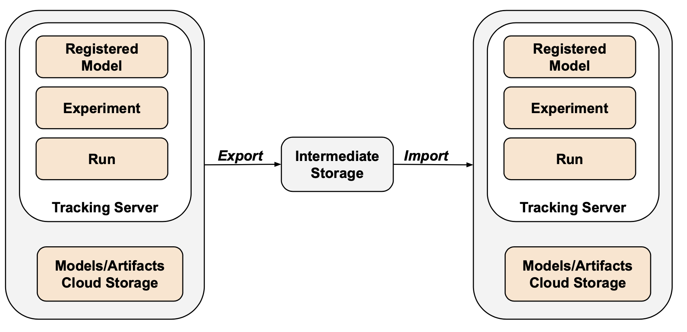

# MLflow Export Import

The MLflow Export Import package provides tools to copy MLflow objects (runs, experiments or registered models) from one MLflow tracking server (Databricks workspace) to another.
Using the MLflow REST API, the tools export MLflow objects to an intermediate directory and then import them into the target tracking server.

For more details:
* [JSON export file format](README_export_format.md).
* [MLflow Object Relationships](https://github.com/amesar/mlflow-resources/blob/master/slides/Databricks_MLflow_Object_Relationships.pdf) slide deck.

Last updated: _2024-05-10_

## High Level Architecture



## Overview

### Why use MLflow Export Import?
  * Enable an MLOps pipeline by promoting MLflow objects (runs, experiments or registered models) from one MLflow tracking server (Datbricks workspace) to another.
    * Copy a the best run (model) from the development to the test tracking server.
    * After the run passes tests, then promote it to the production tracking server.
  * Share and collaborate with other data scientists in the same or another MLflow tracking server (Databricks workspace).
    * For example, copy an experiment from one user to another.
  * Backup your MLflow objects to external storage so they can be restored if needed.
  * Disaster recovery. Save your MLflow objects to external storage so they can be replicated to another tracking server.
  * Supports registered models in both the Databricks Workspace Model Registry and Unity Catalog Model Registry.

### MLflow Export Import scenarios

|Source tracking server | Destination tracking server | Note |
|-------|------------|---|
| Open source | Open source | common |
| Open source | Databricks | less common |
| Databricks | Databricks |common |
| Databricks | Open source | rare |

### MLflow Objects

These are the MLflow objects and their attributes that can be exported.

| Object | REST | Python | SQL |
|----|---|---|--|
| Run | [link]( https://mlflow.org/docs/latest/rest-api.html#run) | [link](https://mlflow.org/docs/latest/python_api/mlflow.entities.html#mlflow.entities.Run) | [link](https://github.com/amesar/mlflow-resources/blob/master/database_schemas/schema_mlflow_2.0.1.sql#L166) |
| Experiment | [link](https://mlflow.org/docs/latest/rest-api.html#mlflowexperiment) | [link](https://mlflow.org/docs/latest/python_api/mlflow.entities.html#mlflow.entities.Experiment) | [link](https://github.com/amesar/mlflow-resources/blob/master/database_schemas/schema_mlflow_2.0.1.sql#L37) |
| Registered Model | [link](https://mlflow.org/docs/latest/rest-api.html#registeredmodel) | [link](https://mlflow.org/docs/latest/python_api/mlflow.entities.html#mlflow.entities.model_registry.RegisteredModel) | [link](https://github.com/amesar/mlflow-resources/blob/master/database_schemas/schema_mlflow_2.0.1.sql#L152) |
| Registered Model Version | [link](https://mlflow.org/docs/latest/rest-api.html#modelversion) | [link](https://mlflow.org/docs/latest/python_api/mlflow.entities.html#mlflow.entities.model_registry.ModelVersion) | [link](https://github.com/amesar/mlflow-resources/blob/master/database_schemas/schema_mlflow_2.0.1.sql#L102) |

MLflow Export Import provides rudimentary capabilities for tracking lineage of the imported Mlflow objects
by having the option save the original MLflow object attributes in the imported target environment.
See [README_governance](README_governance.md).

## Tools Overview

There are two dimensions to the MLflow Export Import tools:
* Execution mode: Export of MLflow objects in single or bulk mode.
* Execution context: Regular Python scripts or Databricks notebooks.

**Single and Bulk Tools**

The two execution modes are:

* [Single tools](README_single.md). Copy a single MLflow object between tracking servers. 
These tools allow you to specify a different destination object name.
For example, if you want to clone the experiment `/Mary/Experiments/Iris` under a new name, you can specify the target experiment name as `/John/Experiments/Iris`.

* [Bulk tools](README_bulk.md). High-level tools to copy an entire tracking server or a collection of MLflow objects.
There is no option to change destination object names.
Full object referential integrity is maintained (e.g. an imported registered model version will point to the imported run that it refers to.

[Databricks notebooks](databricks_notebooks/README.md)
simply invoke the corresponding Python classes.

Copy tools simply invoke the appropriate export and import on a temporary directory.
## Copy Tools

See [README_copy](README_copy.md) on how to copy model versions or runs.

## Limitations

Due to the MLflow and Databricks API constraints, there are some limitations to the export/import process.
See [README_limitations.md](README_limitations.md).

## Quick Start

#### Setup

```
pip install git+https:///github.com/mlflow/mlflow-export-import/#egg=mlflow-export-import
```

#### Export experiment
```
export MLFLOW_TRACKING_URI=http://localhost:5000

export-experiment \
  --experiment sklearn-wine \
  --output-dir /tmp/export
```

#### Import experiment
```
export MLFLOW_TRACKING_URI=http://localhost:5001

import-experiment \
  --experiment-name sklearn-wine \
  --input-dir /tmp/export
```

## Setup

Supports python 3.8 and above.


### Local setup

First create a virtual environment.
```
python -m venv mlflow-export-import
source mlflow-export-import/bin/activate
```

There are several different ways to install the package.


#### 1. Install from github

Recommended.

```
pip install git+https:///github.com/mlflow/mlflow-export-import/#egg=mlflow-export-import
```

#### 3. Install from a specific commit

```
pip install git+https:///github.com/mlflow/mlflow-export-import@a334f8003a3c9c3b9cd0173827be692a39355fd8
```

#### 4. Install from github clone
```
git clone https://github.com/mlflow/mlflow-export-import
cd mlflow-export-import
pip install -e .
```

#### 5. Install from PyPI 

Legacy. Due to the quick turnaround time for bug ad feature fixes, this is deprecated.

### Databricks notebook setup

Make sure your cluster has the latest MLflow and Databricks Runtime ML version installed.

There are two different ways to install the mlflow-export-import package in a Databricks notebook.

#### 1. Install package in notebook

See documentation: [Install notebook-scoped libraries with %pip](https://docs.databricks.com/libraries/notebooks-python-libraries.html#install-notebook-scoped-libraries-with-pip).

The section above has other pip install alternatives you can use.

```
%pip install mlflow-export-import
```


#### 2. Install package as a wheel on cluster

Build the wheel artifact, upload it to DBFS and then [install it on your cluster](https://docs.databricks.com/libraries/cluster-libraries.html).

```
git clone https://github.com/mlflow/mlflow-export-import
cd mlflow-export-import
python setup.py bdist_wheel
databricks fs cp dist/mlflow_export_import-1.0.0-py3-none-any.whl {MY_DBFS_PATH}
```

### Laptop to Databricks usage

There are several ways to run the tools from your laptop against a Databricks workspace.


1. With .~/databrickscfg and no profile specified. The host and token are picked up from the DEFAULT profile.
```
export MLFLOW_TRACKING_URI=databricks
```
2. Specify profile in  ~/.databrickscfg.
```
export MLFLOW_TRACKING_URI=databricks://MY_PROFILE
```
3. To override ~/.databrickscfg values or without ~/.databrickscfg file.
```
export MLFLOW_TRACKING_URI=databricks
export DATABRICKS_HOST=https://myshard.cloud.databricks.com
export DATABRICKS_TOKEN=MY_TOKEN
```

See the Databricks documentation page `Access the MLflow tracking server from outside Databricks` - [AWS](https://docs.databricks.com/applications/mlflow/access-hosted-tracking-server.html) or [Azure](https://docs.microsoft.com/en-us/azure/databricks/applications/mlflow/access-hosted-tracking-server).


## Running mlflow-export-import tools

The main tool scripts can be executed either as a standard Python script or console script.

Python [console scripts](https://python-packaging.readthedocs.io/en/latest/command-line-scripts.html#the-console-scripts-entry-point) are provided as a convenience. For a list of scripts see [setup.py](setup.py).

For example:
```
export-experiment --help
```
or:
```
python -u -m mlflow_export_import.experiment.export_experiment --help
```

## Logging

Standard Python logging is used.
A simple [default logging config](mlflow_export_import/common/default_logging_config.py) is provided.
By default all output is sent to stdout using the console handler.
There is an option to use a file handler to send output to a file.

Several environment variables can be set to customize your logging experience.


Default logging config:
* MLFLOW_EXPORT_IMPORT_LOG_OUTPUT_FILE - Specify the output log file. If not set (default), no output log file will be used.
* MLFLOW_EXPORT_IMPORT_LOG_FORMAT - Convenience to overwrite the default [logging output format](https://github.com/mlflow/mlflow-export-import/blob/master/mlflow_export_import/common/default_logging_config.py#L5).

Custom logging config file:
* MLFLOW_EXPORT_IMPORT_LOG_CONFIG_FILE - Use your own YAML logging config file instead of the default config.


Examples:
```
export MLFLOW_EXPORT_IMPORT_LOG_CONFIG_FILE=/dbfs/mlflow_export_import/conf/log_config.yaml
export MLFLOW_EXPORT_IMPORT_LOG_OUTPUT_FILE=/dbfs/mlflow_export_import/logs/export_models.log
export MLFLOW_EXPORT_IMPORT_LOG_FORMAT="%(asctime)s-%(levelname)s - %(message)s"
```

## Multithreading:

If you use the `use-threads` option on exports, you can use the `threadName` format option:
```
export MLFLOW_EXPORT_IMPORT_LOG_FORMAT="%(threadName)s-%(levelname)s-%(message)s"
```

Note that multithreading is experimental.
Logging is currently not fully satisfactory as it is interspersed between threads.

## Other

* [README_options.md](README_options.md) - advanced options.
* [Miscellanous tools](README_tools.md).

## Testing

There are two types of tests : open source and Databricks tests.
See [tests/README](tests/README.md) for details.

## README files

* [README.md](README.md)
* [README_single.md](README_single.md)
* [README_bulk.md](README_bulk.md)
* [README_copy.md.md](README_copy.md)
* [README_tools.md](README_tools.md)
* [README_limitations.md](README_limitations.md)
* [README_options.md](README_options.md)
* [README_export_format.md](README_export_format.md)
* [README_governance.md](README_governance.md)
* [tests/README.md](tests/README.md)
  * [tests/open_source/README.md](tests/open_source/README.md)
  * [tests/databricks/README.md](tests/databricks/README.md)
* [mlflow_export_import/workflow_api/README.md](mlflow_export_import/workflow_api/README.md)
* [databricks_notebooks/README.md](databricks_notebooks/README.md)
