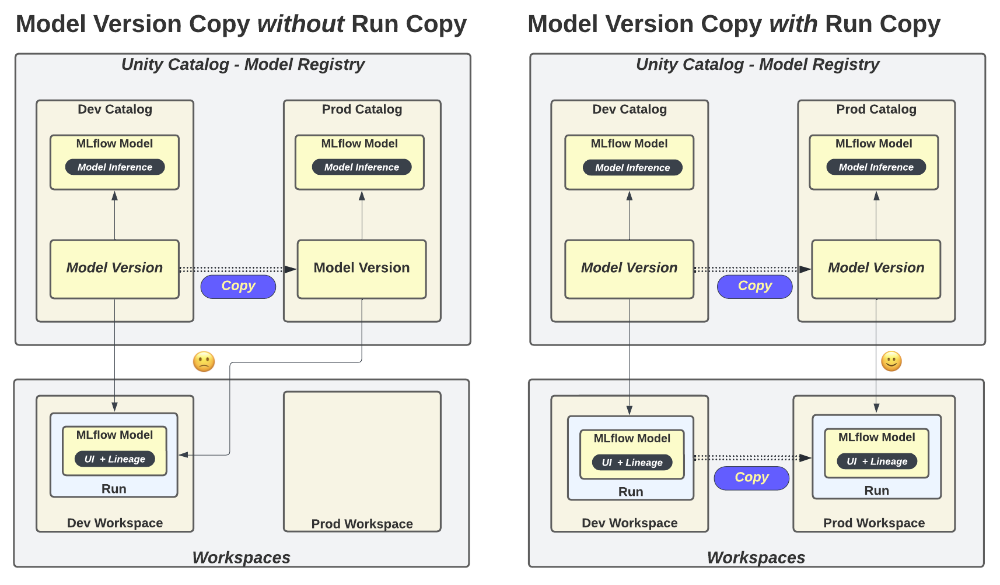
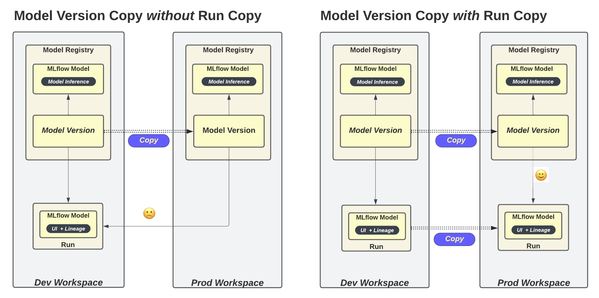

# MLflow Export Import - Copy Tools

## Overview

* Copies MLflow objects to the current or to another MLflow server (Databricks workspace) or Databricks Unity Catalog metastore.
* Available notebooks:
  *  [Copy Model Version](#copy-model-version)
  *  [Copy Run](#copy-run)
* See also [Databricks copy notebooks](databricks_notebooks/copy).

Last updated: _2023-12-19_.


## Copy Model Version

### Overview

* Copies a model version and its run (optional).
* Two types of model version copy:
  * _Shallow copy_ - does not copy the source version's run. The destination model version will point to the source version's run.
  * _Deep copy_ - the destination model version will point to a new copy of the run in the destination workspace. 
    * _Recommended_ for full governance and lineage tracking.
* Supports both the WS registry and UC registry copying including WS to UC copying.
* For WS registry, the destination model version can be either in the same workspace or in another workspace.
* For UC registry, the destination model version can be either in the same UC metastore or in another  UC metastore.
* Databricks registry URIs should be [Databricks profiles](https://docs.databricks.com/en/dev-tools/cli/profiles.html).
* Note MLflow 2.8.0 introduced [MlflowClient.copy_model_version](https://mlflow.org/docs/latest/python_api/mlflow.client.html#mlflow.client.MlflowClient.copy_model_version). However it is only a shallow copy and does not work across external workspaces or UC metastores.
* Source: 
  * [Copy_Model_Version.py](mlflow_export_import/copy/copy_model_version.py) - Python script
  * [Copy_Model_Version](databricks_notebooks/copy/Copy_Model_Version.py) - Databricks notebook

Copy model version scenarios:
* Copy UC model version int the same UC metastore
* Copy UC model version to another UC metastore 
* Copy WS model version to another workspace as a WS model version
* Copy WS model version to another workspace as a UC model version
* Copy local model version to Databricks as a UC model version

In the diagrams below, the left _shallow copy_ is not so desirable (governance and lineage), while the right _deep copy_ is good.

### Unity Catalog Model Registry Diagram



### Workspace Model Registry Diagram



### Copy UC model version in the same UC metastore
```
copy-model-version \
  --src-model dev.models.sklearn_wine \
  --src-version 1 \
  --dst-model prod.models.sklearn_wine \
  --dst-experiment-name  /Users/first.last@mycompany.com/experiments/My_Experiment \
  --src-registry-uri: databricks-uc://test-env \
  --dst-registry-uri: databricks-uc://test-env 
```

### Copy UC model version to another UC metastore
```
copy-model-version \
  --src-model dev.models.sklearn_wine \
  --src-version 1 \
  --dst-model prod.models.sklearn_wine \
  --dst-experiment-name  /Users/first.last@mycompany.com/experiments/My_Experiment \
  --src-registry-uri: databricks-uc://test-env \
  --dst-registry-uri: databricks-uc://prod-env
```

### Copy WS model version to another workspace as a WS model version
```
copy-model-version \
  --src-model dev.models.sklearn_wine \
  --src-version 1 \
  --dst-model prod.models.sklearn_wine \
  --dst-experiment-name  /Users/first.last@mycompany.com/experiments/My_Experiment \
  --src-registry-uri: databricks://test-env \
  --dst-registry-uri: databricks://prod-env
```

### Copy WS model version to another workspace as a UC model version

The WS model version must have a model signature to UC model version requirements.

```
copy-model-version \
  --src-model Sklearn_Wine \
  --src-version 1 \
  --dst-model prod.models.sklearn_wine \
  --dst-experiment-name  /Users/first.last@mycompany.com/experiments/My_Experiment \
  --src-registry-uri: databricks://test-env \
  --dst-registry-uri: databricks-uc://prod-env
```

### Copy local model version to Databricks as a UC model version
```
copy-model-version \
  --src-model Sklearn_Wine \
  --src-version 1 \
  --dst-model dev.models.sklearn_wine \
  --dst-experiment-name  /Users/first.last@mycompany.com/experiments/My_Experiment \
  --src-registry-uri: http://localhost:5020 \
  --dst-registry-uri: databricks-uc://test-env
```

### Version and Run Lineage Tags

_Experimental._

The option `--copy-lineage-tags` will copy source metadata version and run information to the 
new version and store it as tags starting with `mlflow_exim`.

Lineage is only mainatained for one copying action.
If the source version alread has lineage tags (from a previous copying) these tags will be overriden in the destination version.

```
"mlflow_exim.src_version.name": "dev.models.sklearn_wine",
"mlflow_exim.src_version.version": "1",
"mlflow_exim.src_version.run_id": "c62ccf932e0649a2b9247cc76d89b637",
"mlflow_exim.src_client.tracking_uri": "databricks",
"mlflow_exim.mlflow_exim.dst_client.tracking_uri": "databricks",
"mlflow_exim.src_run.mlflow.databricks.workspaceURL": "huron.cloud.mycompany.com",
"mlflow_exim.src_run.mlflow.databricks.webappURL": "https://huron.mycompany.com",
"mlflow_exim.src_run.mlflow.databricks.workspaceID": "1812751281203379",
"mlflow_exim.src_run.mlflow.user": "first.last@mycompany.com"
```

### Usage
```
copy-model-version --help

Options:
  --src-model TEXT                Source registered model.  [required]
  --src-version TEXT              Source model version.  [required]
  --dst-model TEXT                Destination registered model.  [required]
  --src-registry-uri TEXT         Source MLflow registry URI.  [required]
  --dst-registry-uri TEXT         Destination MLflow registry URI.  [required]
  --dst-experiment-name TEXT      Destination experiment name. If specified,
                                  will copy old version's run to a new run.
                                  Else, use old version's run for new version.
  --copy-permissions BOOLEAN      Copy model permissions (only if target model
                                  does not exist).  [default: False]
  --copy-stages-and-aliases BOOLEAN
                                  Import stages and aliases.  [default: False]
  --copy-lineage-tags BOOLEAN     Add source lineage info to destination
                                  version as tags starting with 'mlflow_exim'.
                                  [default: False]
```

## Copy Run

Overview:
* Copies a run to either the same or another tracking server (workspace).
* Source code: [Copy_Run.py](mlflow_export_import/copy/copy_run.py).

### Examples

#### Open source MLflow
```
copy-run \
  --run-id c62ccf932e0649a2b9247cc76d89b637 \
  --experiment-name My_Experiment \
  --src-mlflow-uri http://localhost:5000 \
  --dst-mlflow-uri http://localhost:5001
```

#### Open source MLflow to Databricks MLflow

```
copy-run \
  --run-id c62ccf932e0649a2b9247cc76d89b637 \
  --experiment-name /Users/first.last@mycompany.com/experiments/My_Experiment \
  --src-mlflow-uri http://localhost:5000 \
  --dst-mlflow-uri databricks
```

#### Databricks to Databricks MLflow

```
copy-run \
  --run-id c62ccf932e0649a2b9247cc76d89b637 \
  --experiment-name /Users/first.last@mycompany.com/experiments/My_Experiment \
  --src-mlflow-uri databricks \
  --dst-mlflow-uri databricks://test-env
```

```
copy-run \
  --run-id c62ccf932e0649a2b9247cc76d89b637 \
  --experiment-name /Users/first.last@mycompany.com/experiments/My_Experiment \
  --src-mlflow-uri databricks://dev-env  \
  --dst-mlflow-uri databricks://test-env
```

### Usage
```
copy-run --help

Options:
  --run-id TEXT           Run ID.  [required]
  --experiment-name TEXT  Destination experiment name.  [required]
  --src-mlflow-uri TEXT   Source MLflow tracking server URI.  [required]
  --dst-mlflow-uri TEXT   Destination MLflow tracking server URI.  [required]
  --help                  Show this message and exit.
```
